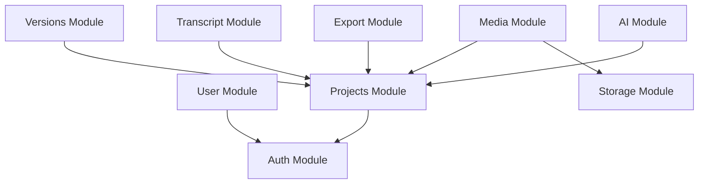

# System Architecture

This document describes the high-level architecture of the AI Caption Editor Backend.

## Technology Stack

* **Language:** Java 21
* **Framework:** Spring Boot 3.3.x (Web, Data JPA, Security, Validation)
* **Database:** PostgreSQL 16
* **Database Migrations:** Flyway
* **APIs:** RESTful endpoints documented via SpringDoc OpenAPI (Swagger UI)
* **Storage:** Extensible storage abstraction (defaults to Local Storage)
* **Background Processing:** In-Memory Job Queue & Worker system (utilizing FFmpeg for media export)

---

## Modular Component Structure

The application is structured into decoupled modules under the package `com.aicaptioneditor.modules`:

### Module Descriptions

1. **Auth (`com.aicaptioneditor.modules.auth`)**
   - Implements local JWT registration/login/logout with token rotation.
   - Supports pluggable authentication providers (Local or Firebase ID Token verification).
   - Rate limiting filter configured before authentication checks.

2. **User (`com.aicaptioneditor.modules.user`)**
   - Manages user profiles (`GET`, `PATCH`, `DELETE` `/api/v1/users/me`).
   - Automatically synchronizes profile data from Firebase if using social authentication.

3. **Projects (`com.aicaptioneditor.modules.projects`)**
   - Core entity representing subtitle projects, language settings, and title metadata.
   - Enforces user-ownership isolation across all data mutations.

4. **Transcript (`com.aicaptioneditor.modules.transcript`)**
   - Manages transcript lines and detailed subtitle segments (with word-level timestamps and speaker IDs).
   - Validates timestamps on segment edits to prevent overlap.

5. **Versions / Autosave (`com.aicaptioneditor.modules.versions`)**
   - Captures periodic autosaves of project state.
   - Tracks version history and enables users to roll back projects to any snapshot in time.

6. **Media Asset (`com.aicaptioneditor.modules.media`)**
   - Handles media asset uploads (supporting video, audio, and subtitle files).
   - Validates files for size (max 100MB) and MIME type filters.

7. **Storage (`com.aicaptioneditor.modules.storage`)**
   - Abstraction interface (`StorageProvider`) for file persistence.
   - Implements `LocalStorageProvider` for self-hosted instances, with a clean path design mapping local paths to container volumes.

8. **AI Engine (`com.aicaptioneditor.modules.ai`)**
   - Interfaces with AI providers to transcribe audio, rewrite text, translate languages, and generate subtitles.
   - Built on an extensible `AIProvider` registry, supporting `MockAIProvider`, `OllamaProvider` (local running models), and `OpenRouterProvider`.

9. **Export Engine (`com.aicaptioneditor.modules.export`)**
   - Enqueues video/audio/subtitle export jobs.
   - Background worker processes jobs sequentially using local system FFmpeg utilities.

---

## Architectural Patterns

### 1. Provider Pattern (AI & Storage)
To remain fully open source and self-hostable while allowing cloud scalability:
- **Storage:** Developers implement the `StorageProvider` interface. Moving from local uploads to S3-compatible systems requires no change in the media asset domain.
- **AI:** The `AIProvider` interface abstracts provider calls. The system selects the active provider dynamically at startup based on property settings.

### 2. Background Queue & Worker Pattern
Media rendering/export is resource-intensive.
- Jobs are created with a `QUEUED` status and stored in the database.
- A thread-safe, in-memory `ExportQueue` receives the job ID.
- A single-thread background Executor service (`ExportWorker`) polls the queue, executes FFmpeg commands asynchronously, updates progress/database state, and flags completion.

### 3. JSR-380 Request Validation
All requests are validated at the controller boundary using `@Valid` annotations and JSR-380 constraints (`@NotBlank`, `@Size`, etc.). Global exception handling intercepts binding exceptions to format error responses into a consistent, readable API response schema.
